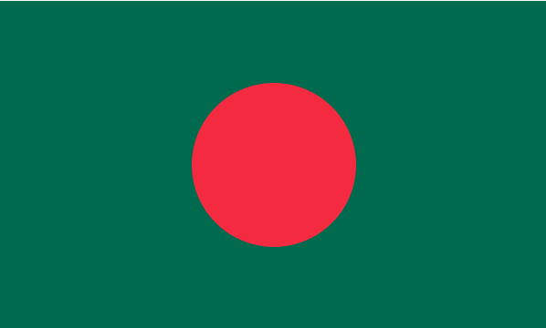

# Task-1.1-Geometric-Precision-Bangladesh-Flag-

## **Project Overview**

This project recreates the national flag of Bangladesh using pure HTML and CSS.
The goal is to demonstrate geometric positioning and CSS layout techniques while maintaining the official 10:6 flag ratio.

The design includes:

- A bottle green rectangular background

- A perfect red circle positioned at the center

## Live Demo

You can view the live project here:

🔗 Live Link:
[Live demo](https://bangladflag.netlify.app/)

## Screenshot

Below is a preview of the project:

